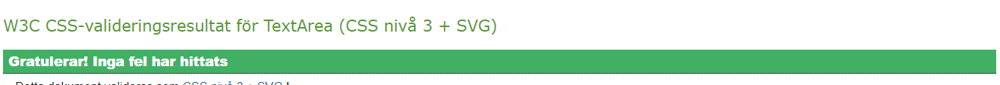

# The Rock Paper Scissor Lizard Spock Game

The Rock Paper Scissor Lizard Spock game is an improved version of the old Rock Paper Scissors game created by the popular sitcom-show The Big Bang Theory. In the show one of the main characters called Sheldon expresses his opinon that Rock paper scissors is too simplistic and therefore adds two additions to the game, Lizard and Spock.

The Rock Paper Scissor Lizard Spock Game website is a website that strives to let more people try out and have fun with this new version of Rock Paper scissors.

Live link found here -> [The Stone-Paper-Scissor-Lizard-Spock-Game](https://buster753.github.io/project2/)

# Site owner goals
* To create a fun game of Rock Paper Scissor Lizard Spock!
* To spread and popularize the game.
* To learn more about coding and website devolpment by creating and publishing a website.

# Design
The design of the website was made by taking inspiration from a previous project and by researching pubished rock paper scissors games.

The colors of the website are calming with a victorian aesthetic. Whilst not a color combination marketed for games, the calming nature of the colors can be good for a potentially hectic game.

The font of the website is easiy read and was found using google fonts. The font after chosen was implemented by adding it to the css file.

The logos used for the buttons of the website were taken from fontawesome. Here choices were made to enlarge the logos in order to gain better visibility as the original size and thickness would be difficult to see for a potential vision impaired user.

# Features

## Changing Titles

The title of the game is both responsive and changes depending on game result. It incudes different sentences showed depending on user and computer choice. Also displays different sentence structures depending on the result of the game.

## Scoreboard

The website also has a Scoreboard that keeps track of Player and Computer score.

## Buttons for every choice

One image/logo for every choice is displayed. The images/logos are clickable and changes opacity when hovered over with the mouse.

# Testing

## HTML, CSS and JS validation

### HTML validation

* No errors however some unnesecary backslashes caused from saving the page in codeanywhere. Unsure of cause.

### Css validation

* No errors found

### JS validation

* No errors found

### Lighthouse

* The website showed great performance during lighthouse testing. A hundred was given in Best Practices and Performance showing good code was written. The website also got an 95 in accessibility showing good design choices were made where colors and fonts were easy to read.

### Browser Testing
The website was tested on Safari, Opera and Goole Chrome.
* No errors or differences in performance between browsers was found.

### Device Testing
 * Device Testing was done using different devices. The devices used in testing included an ipad, an iphone, a macbook pro and a desktop pc.

* During testing no differences in performance or responsability was found.

### Button Testing 
* All buttons were pressed and tested manually both using a mouse and a touchscreen to make sure the website works as intended.

### Game Testing
To ensure the game works properly different properties of the game was tested.
* The game shows a different title after every game played.
* The Scoreboard was shown to update after each hand played.
* The game rules are followed and the correct winner and loser is decided.

# Technologies Used

* Html, CSS and JS
* Google fonts
* Github
* W3c schools
* Fontawesome
* Browser dev tools
* Codeaywhere
* Vscode
  
# Struggles and Bugs
The Bugs and struggles of creating this game mainly came from trying to figure out eventListeners. 
* Because of a syntax error the buttons would automatically clickthemself at page load.

This was later resolved after looking through some stackoverflow pages and docs at W3C Schools.

# Deployment
Deployment of this website was done through github using the following steps.

1. Whilst on the correct repository on Github select settings on the top of the page.
2. Select pages from the menubar on the left.
3. Under source click on the Branc-dropdownmenu and select main branch.
4. Save.
5. If done correctly deployment should now be confirmed by a text message telling you that your site is now published on (webaddress).

# Credits

### Design
* [Color Combination](<https://webflow.com/blog/best-color-combinations>)
* [Fonts](https://fonts.google.com)

### Code resources 
* [W3C Schools](https://www.w3schools.com)
* [Stack overflow](https://stackoverflow.com)

### Inspiration
* [Inspiration 1](https://www.codewithfaraz.com/content/107/create-rock-paper-scissors-game-with-html-css-and-javascript#javascript-code)
* [Inspiration 2](https://www.geeksforgeeks.org/rock-paper-and-scissor-game-using-javascript/)

# Acknowledgements
Thank you to my mentor Antonio for your amazing help and advice when creating this project.